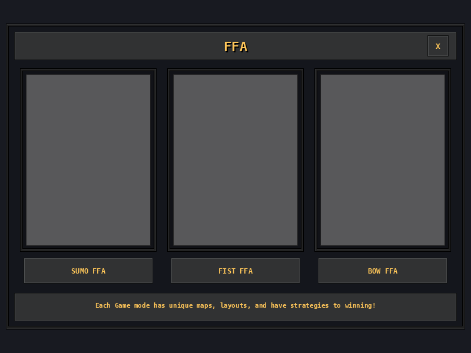

# JSON UI Builder

Editor visual para criar interfaces do **Minecraft Bedrock** e baixá-las como um
addon pronto para instalar — resource pack, behavior pack e script, num arquivo
só.

Você desenha arrastando elementos numa tela; o editor cuida do JSON UI, das
coordenadas, do nine-slice, das texturas e do script que abre o menu no jogo.



---

## Índice

- [Rodando o projeto](#rodando-o-projeto)
- [Deixando o projeto no ar](#deixando-o-projeto-no-ar)
- [Usando o editor](#usando-o-editor)
- [Baixando o pacote](#baixando-o-pacote)
- [Instalando no Minecraft](#instalando-no-minecraft)
- [O script gerado](#o-script-gerado)
- [Como funciona por dentro](#como-funciona-por-dentro)
- [Quando algo não aparece](#quando-algo-não-aparece)
- [Limitações conhecidas](#limitações-conhecidas)
- [Estrutura do repositório](#estrutura-do-repositório)
- [Origem, créditos e uso](#origem-créditos-e-uso)

---

## Rodando o projeto

Precisa de [Bun](https://bun.sh). Node também funciona trocando `bun` por `npm`.

```bash
git clone https://github.com/UnknownMaker-dev/json-ui-builder-web
cd json-ui-builder-web
bun install
bun run dev
```

Abre em `http://localhost:5173`.

| comando | o que faz |
|---|---|
| `bun run dev` | servidor de desenvolvimento, com recarga automática |
| `bun run build` | gera o site estático em `dist/` |
| `bun run preview` | serve o `dist/` para conferir antes de publicar |

O editor é inteiramente client-side: **não há backend, banco nem upload**. Tudo
acontece no navegador, e o pacote é montado na sua máquina.

## Deixando o projeto no ar

O repositório já vem com o workflow de publicação no GitHub Pages
(`.github/workflows/deploy.yml`). Para ativar:

1. No GitHub: **Settings → Pages → Source: GitHub Actions**.
2. Dê push na `master`.

O site sobe em `https://<usuário>.github.io/<repositório>/` e é republicado a
cada push.

O Pages serve o projeto numa subpasta, então o build usa a variável `BASE`:

```bash
BASE=/json-ui-builder-web/ bun run build
```

O workflow define isso sozinho a partir do nome do repositório. Localmente,
`bun run dev` continua em `/`. Se preferir outro host (Vercel, Netlify, Cloudflare
Pages), basta apontar para `bun run build` e publicar a pasta `dist/` — sem
`BASE`, porque esses servem na raiz.

> Os caminhos de textura são gravados no projeto como `/presets/...` e só viram
> URL completa na hora de usar. Um arquivo de projeto salvo continua abrindo em
> qualquer endereço.

## Usando o editor

### Telas (abas)

Cada aba é uma tela, e vira **um arquivo JSON UI** dentro do pacote.

O **nome da aba não é enfeite**: é o identificador que o script manda no título
do formulário e que o jogo usa para escolher qual tela mostrar. Duplo clique
renomeia.

> Se o nome de uma tela for trecho do nome de outra (`Menu` e `Menu Loja`), as
> duas abrem sobrepostas no jogo — o editor avisa antes de você exportar.

### Elementos

| elemento | vira, no JSON UI | contém filhos |
|---|---|---|
| **Panel** | `panel`, ou `image` se tiver textura | sim |
| **Stack Panel** | `stack_panel` | sim |
| **Collection Panel** | `collection_panel` | sim |
| **Scrolling Panel** | `stack_panel` + `common.scrolling_panel` | sim |
| **Image** | `image` | sim |
| **Button** | herda `common_buttons.light_content_button` | não |
| **Label** | `label` | não |

- **Arrastar e redimensionar** direto no canvas, com 8 alças. `SHIFT` mantém a
  proporção, `ALT` redimensiona a partir do centro.
- **Setas** movem 1px (`SHIFT` = 10px). Dentro de um stack panel, elas
  reordenam num eixo e mudam o alinhamento no outro.
- **Ctrl+Z / Ctrl+Y**, **Ctrl+C / Ctrl+V**, `Delete`.
- **Explorer**: arraste para reordenar ou trocar de pai. Solte no miolo de um
  container para entrar nele, nas bordas para inserir antes/depois, e na área
  tracejada embaixo da árvore para tirar do container.
- **Zoom**: ajusta-se à janela sozinho; `Ctrl` + roda do mouse ou os botões no
  canto controlam manualmente.

### Stack panel

Diferente de um painel comum, um stack panel posiciona os filhos sozinho.
X e Y ficam desabilitados dentro dele — quem manda são:

- **Alinhar na pilha** (no filho) — no eixo transversal: esquerda/centro/direita
  numa pilha vertical, topo/meio/base numa horizontal.
- **Distribuir os filhos** (no stack) — o bloco inteiro no eixo da pilha.
- **Espaçamento** e **Recuo interno** (no stack), **Margem antes** (no filho).

> JSON UI não tem `margin` nem `gap`. O editor gera painéis vazios invisíveis
> entre os itens para produzir o espaço.

### Texturas

- **Seletor** com cinco conjuntos embarcados; escolher uma textura adota também
  o nine-slice que vem com ela.
- **Importar imagem de fundo** sobe um PNG/JPG e cria o elemento atrás dos
  outros, na proporção original.
- Suas texturas ficam no navegador e vão junto no pacote.

### Salvando

O rascunho é guardado no navegador automaticamente. Para não depender disso,
**Salvar** baixa um `.json` com todas as telas, e **Abrir projeto** o restaura.

## Baixando o pacote

**Baixar pacote** abre a janela de exportação, onde você define:

- **Nome do pacote** — como aparece na lista de recursos do jogo.
- **Item que abre o menu** — `minecraft:stick` por padrão.
- **Versão da API de script** — 2.x por padrão; troque para 1.x se o script não
  carregar na sua versão do jogo.

A mesma janela mostra o `main.js` que será gerado, antes de baixar.

Sai um `.mcaddon` (ou `.zip`, se preferir) com:

```
<pacote>_RP/                      resource pack
├── manifest.json
├── ui/
│   ├── _ui_defs.json             registra os arquivos novos
│   ├── server_form.json          roteia: qual tela mostrar para cada título
│   └── <pacote>/<tela>.json      uma por aba
├── textures/ui/<pacote>/         PNGs + .json de nine-slice
└── LEIA-ME.txt

<pacote>_BP/                      behavior pack
├── manifest.json
├── scripts/main.js               abre as telas
└── LEIA-ME.txt
```

Os UUID são estáveis entre exportações e a versão sobe o patch a cada uma: o
jogo reconhece como **atualização do mesmo pacote**, sem encher a lista de
cópias.

## Instalando no Minecraft

1. Dois cliques no `.mcaddon` — o jogo importa os dois packs.
2. Nas configurações do mundo, ative **os dois**: `<pacote>_RP` e `<pacote>_BP`.
3. Ligue **Beta APIs** (Experimentos). O script não roda sem isso.
4. Entre no mundo e use o item configurado com o botão direito.

Preferindo instalar à mão, renomeie para `.zip` e extraia as duas pastas em
`com.mojang/development_resource_packs` e `development_behavior_packs`.

## O script gerado

```js
import { world, system } from "@minecraft/server";
import { ActionFormData } from "@minecraft/server-ui";

const TRIGGER_ITEM = "minecraft:stick";

const SCREENS = {
    "FFA": {
        buttons: [
            { text: "SUMO FFA" },
            { text: "FIST FFA" },
            { text: "BOW FFA" },
        ],
    },
};

function showScreen(player, name) {
    const screen = SCREENS[name];
    if (!screen) return;

    const form = new ActionFormData().title(name);
    for (const button of screen.buttons) {
        if (button.icon) form.button(button.text, button.icon);
        else form.button(button.text);
    }

    form.show(player).then((response) => {
        if (response.canceled) return;
        const clicked = screen.buttons[response.selection];
        player.sendMessage("§aClicou em: §f" + clicked.text);
    });
}

world.afterEvents.itemUse.subscribe((event) => {
    if (event.itemStack?.typeId !== TRIGGER_ITEM) return;
    system.run(() => showScreen(event.source, "FFA"));
});
```

Duas regras ao editar:

- **O título tem que ser o nome da tela.** É por ele que o jogo escolhe o
  desenho. Mudou num lado, mude no outro.
- **A ordem dos botões é um contrato.** O botão N no editor responde pelo
  N-ésimo `form.button(...)`. Inserir um no meio desloca todos os seguintes.

Para navegar entre telas, chame `showScreen` de novo dentro do `then`:

```js
if (clicked.text === "Loja") showScreen(player, "Loja");
```

## Como funciona por dentro

### O roteamento

O Minecraft não deixa criar uma tela nova que o jogo abra sozinho — sempre se
parasita uma tela existente. Aqui é o formulário do `ActionFormData`.

O servidor não conversa com a interface, mas manda o **título** do formulário, e
a interface lê esse título. É esse o canal:

```json
"bindings": [
    { "binding_name": "#title_text" },
    { "binding_type": "view",
      "source_property_name": "(not ((#title_text - 'FFA') = #title_text))",
      "target_property_name": "#visible" }
]
```

Como JSON UI não tem operador "contém", usa-se **subtração de string**: tirar
`'FFA'` do título mudou alguma coisa? Se mudou, o título continha aquilo — e a
tela aparece.

### As coordenadas

O editor trabalha em pixels absolutos, o Minecraft em unidades próprias. Todo
valor é multiplicado por `UI_SCALAR` (0.36) na exportação, e cada tela vira um
painel do tamanho do canvas ancorado no **centro**, para o desenho ficar
centralizado em qualquer resolução.

### Os botões

Cada botão sai embrulhado num `collection_panel` que declara
`collection_name: "form_buttons"`, contendo um controle que herda
`common_buttons.light_content_button` com o `collection_index`.

Essa estrutura é específica: `collection_index` **só é aceito num controle do
tipo `button`**, e `collection_name` **só num `collection_panel`**. Num painel
comum o jogo recusa os dois com `Unknown property`, e o botão some da tela.

### O nine-slice

O `.json` que acompanha a textura é a fonte da verdade — ele traz as bordas
reais da arte (frequentemente assimétricas, como `[2,2,2,5]`) e o `base_size`
é lido do próprio PNG. Bordas que não cabem na imagem são descartadas com aviso,
em vez de virarem borrão no jogo.

Há um guia prático de JSON UI em **[JSON-UI.md](JSON-UI.md)**, cobrindo tipos,
herança, variáveis, unidades, âncoras, bindings e as armadilhas mais comuns.

## Quando algo não aparece

Ligue o **Content Log**: Configurações → Criador → *Content Log*. É a única
mensagem de erro que o JSON UI dá.

| sintoma | causa provável |
|---|---|
| Nada acontece ao usar o item | packs não ativados, ou Beta APIs desligadas |
| O script não carrega | versão da API — troque 2.x ↔ 1.x e gere de novo |
| Abre o formulário padrão | o título do script não bate com o nome da tela |
| Um botão não aparece | o texto dele vem do script; botão sem texto fica invisível |
| Botão clica no lugar errado | ordem dos botões diferente entre editor e script |
| Textura faltando | o Content Log diz o caminho exato |
| Duas telas sobrepostas | um nome de tela é trecho do outro |

## Limitações conhecidas

- **Enquanto o pack estiver ativo, formulários que não são seus abrem vazio.**
  Rotear exige substituir `ui/server_form.json` inteiro, e ele agora só roteia.
- Não há `toggle`, `slider`, `grid` nem `edit_box`.
- `collection_panel` não repete conteúdo: os botões são posicionados à mão.
  Listas dinâmicas exigiriam `factory`, ainda não implementado.
- Reimportar um JSON UI exportado funciona, mas não devolve a estrutura exata.
- Bindings personalizados podem ser escritos à mão, sem assistente.

## Estrutura do repositório

```
src/
├── components/
│   ├── editor/        toolbar, abas, canvas, explorer, sidebars, modais
│   └── elements/      como cada tipo é desenhado, e o nine-slice em canvas 2D
├── stores/            estado (telas, seleção, histórico, zoom) em Pinia
├── types/             modelo de elemento e de tela
├── config/            UI_SCALAR e demais números de calibração
└── utils/
    ├── json-ui-exporter.ts    árvore → JSON UI
    ├── json-ui-importer.ts    JSON UI → árvore
    ├── json-ui-templates.ts   botão de formulário e roteador
    ├── pack-builder.ts        monta o .mcaddon
    ├── scripter.ts            gera o main.js
    ├── nineslice.ts           recorte 9 fatias em canvas
    └── project-file.ts        salvar e abrir projeto
```

## Origem, créditos e uso

Este editor é uma reescrita em Vue 3 de
**[SebTheSigma/JSON-UI-Maker](https://github.com/SebTheSigma/JSON-UI-Maker)**,
de onde vieram o algoritmo de conversão de coordenadas, os números de calibração
e os templates de JSON UI. O crédito da abordagem é dele.

> **Leia [NOTICE.md](NOTICE.md) antes de reutilizar ou publicar este
> repositório.** O projeto de origem **não declara licença**, o que legalmente
> significa todos os direitos reservados — e nenhuma licença colocada aqui muda
> isso. O NOTICE explica a situação e o que efetivamente resolve.

O código original deste repositório está sob [MIT](LICENSE), com o escopo
descrito no próprio arquivo.

**Projeto não oficial.** Sem vínculo, patrocínio ou aprovação da Mojang Studios
ou da Microsoft. "Minecraft" é marca registrada da Mojang Synergies AB. Nenhum
código, asset ou binário do jogo é distribuído aqui — o projeto apenas gera
arquivos no formato JSON UI.

Fornecido "como está", sem garantia. Os pacotes gerados alteram a interface do
jogo; faça backup dos seus mundos antes de testar.
